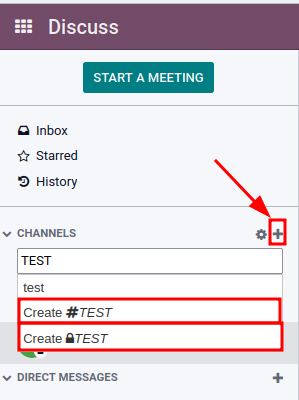
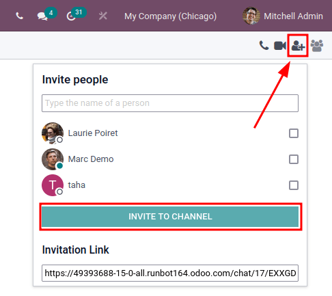
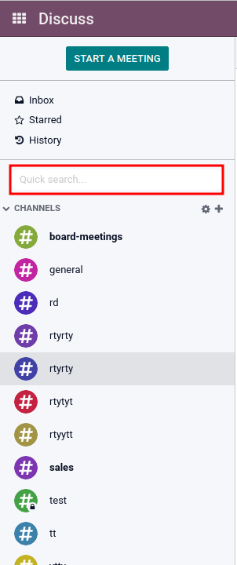

======================================
Efficiently communicate using channels
======================================

Use channels to organize discussions between individual teams, departments, projects, or any other
group that requires regular communication. This way, everyone is in the loop and updated with the
latest developments.

Public and private channels
===========================

A *Public* channel can be seen by everyone, while a *Private* one is only visible to users invited
to it. To create a new channel, click on the plus [ + ] icon next to :guilabel:`Channels` in the
left menu. After typing the name of the channel two options will appear. The first is a channel with
a hashtag [ # ] which indicates that it is a public channel. The second option is a channel with a
lock icon [ 🔒 ] next to it, this indicates that it is a private channel. Select the channel type
that best fits the communication needs.

.. tip::
   A public channel is best used when many employees need to access information (such as company
   announcements), whereas a private channel could be used whenever information should be limited
   to specific groups (such as a specific department).

Configuration options
---------------------

The channel's :guilabel:`name`, :guilabel:`description`, and :guilabel:`privacy` can be modified by
clicking on the *Channel Settings* icon [ ⚙️ ] on the left sidebar next to the channel name.

Privacy and Members
~~~~~~~~~~~~~~~~~~~

Changing :guilabel:`Who can follow the group's activities?` allows a user to control which groups
can have access to the channel. Note that allowing :guilabel:`Everyone` to follow a private channel
lets other users view and join it, as they would a public one.

If a user chooses :guilabel:`Invited people only`, go to the :guilabel:`Members` tab to add the
members, or, go to Discuss' main page, select the channel and click on :guilabel:`Invite to
Channel`.

When the :guilabel:`Selected group of users` option is selected, it reveals the ability to
add an :guilabel:`Authorized Group`, :guilabel:`Auto Subscribe Groups` and :guilabel:`Auto Subscribe
Departments`. The option :guilabel:`Auto Subscribe Groups` automatically add its members as
followers. In other words, while :guilabel:`Authorized Groups` limits which users can access the
channel, :guilabel:`Auto Subscribe Groups` automatically adds the user as a member as long as they
are part of the group. The same is true for :guilabel:`Auto Subscribe Departments`.

Quick search bar
================

Once at least 20 channels, direct message and live chat conversations (if the module is installed
on your database) are pinned in the sidebar, a :guilabel:`Quick search…` bar is displayed. It is a
clever way to filter conversations and quickly find one that is needed.

Finding channels
----------------

Click on the *Channel Settings* icon [ ⚙️ ] on the left sidebar next to the :guilabel:`Channels`
menu item. Here a user can browse through the list of public channels, and join or leave
them from a single screen.

There is also the ability to apply filters criteria and save them for later use. The search function
accepts wildcards by using the underscore character [ _ ] to represent a single character.

.. seealso::
   - :doc:`get_started`
   - :doc:`plan_activities`
