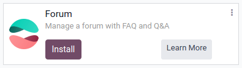
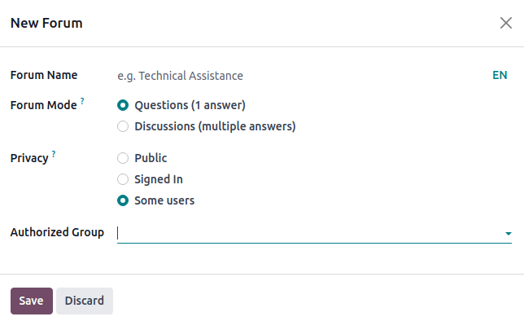
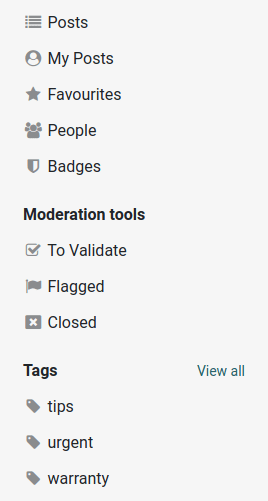
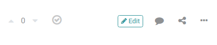

=====
Forum
=====

**Odoo Forum** enables you to build a community, encourage engagement and knowledge sharing, and
provide customer support.

.. important::
   You can manage your forum on both the **frontend** and the **backend**. The **frontend**
   allows you to create a forum quickly from your website, while the **backend** allows you to work
   on it from the :guilabel:`Website` or :guilabel:`eLearning` apps (if enabled), and provides
   access to more advanced configurations.

.. seealso::
   - `Forum product page <https://www.odoo.com/app/forum>`_
   - `eLearning product page <https://www.odoo.com/app/elearning>`_
   - :doc:`Website documentation <website>`

To activate :guilabel:`Forum`, go to :guilabel:`Apps`, search for the :guilabel:`Forum` module, and
install it. A new :guilabel:`Forum` page appears on your website.

.. _forum/creation:

Forum creation
==============

From your website, click :guilabel:`+New`, then on :guilabel:`Forum`, to create a new forum.

In the pop-up box, fill in the following information:

- :guilabel:`Forum Name`: add the name of your forum;
- :guilabel:`Forum Mode`: select :guilabel:`Questions` (only one answer allowed) or
  :guilabel:`Discussions` (multiple answers allowed);
- :guilabel:`Privacy`: select :guilabel:`Public` (everyone can access it), :guilabel:`Signed In`
  (your forum is visible for signed-in users only), or :guilabel:`Some users` (your forum and its
  content are hidden for non-members of selected :guilabel:`Authorized Group`).

Click :guilabel:`Save`.

.. tip::
   You can also create a forum by going to :menuselection:`Website --> Configuration --> Forum:
   Forums` and clicking the :guilabel:`New` button.

Next, it is important to define the :ref:`Karma gains <forum/karma-gains>` and :ref:`Karma-related
rights <forum/karma-related-rights>`.

.. _forum/karma-gains:

Karma gains
-----------

Karma points are given to the forum's active participants to keep them involved and provide them
**access to functionalities like voting, commenting, and editing**, when they reach a certain Karma
level.

The number of points is set by default. To modify it, go to :menuselection:`Website -->
Configuration --> Forum: Forums`, select the forum, and go to the :guilabel:`Karma gains` tab. Then,
click on a number and edit it.

.. note::
   Each new user automatically receives three points when their e-mail address is validated.

.. tip::
   If you have the **eLearning** app, completing quizzes can grant you points.

.. _forum/karma-related-rights:

Karma-related rights
--------------------

Karma rights are used to determine **what a user can and cannot do**, like access rights.

To set up a moderation system with Karma points to give your most active members access to more
functionalities and to reduce spamming messages, go to :menuselection:`Website --> Configuration -->
Forum: Forums`, select the forum, and go to the :guilabel:`Karma Related Rights` tab. Click a
number to edit it.

Post creation
=============

.. note::
   Only logged-in users can post questions and answers to avoid spam.

To create a new post, go to the forum on the website, click :guilabel:`New Post`, and fill in the
following information:

- :guilabel:`Title`: add your question or the topic of your post;
- :guilabel:`Description`: add a description for your question. Type `/` to use a command and insert
  various elements to layout and format your post.
- :guilabel:`Tags`: add :ref:`tags <forum/tags>` to help filter questions and answers related to the
  same topic.

Click :guilabel:`Post Your Question`.

Post management
===============

Go to the :guilabel:`Forum` page on your website and select the forum you want to access. From
the left column, you can access the following:

- :guilabel:`My Posts`: display all your posts;
- :guilabel:`Favourites`: display posts you bookmarked as favorite;
- :guilabel:`People`: display users and their :ref:`Karma gains <forum/karma-gains>` (=**XP**);
  number of :guilabel:`Badges`, and :guilabel:`Certifications`;
- :guilabel:`Badges`: active contributors can be rewarded with :ref:`badges <forum/badges>`
  according to their participation. Badges are visible on both their profile page and their posts;

Use the :guilabel:`Moderation tools` to see posts :guilabel:`To Validate`, posts that have been
:guilabel:`Flagged`, or :guilabel:`Closed` posts.

You can also see the :guilabel:`Tags` used across the posts. Click :guilabel:`View all` to view all
tags and retrieve discussions based on their tags.

.. _forum/interacting:

Interacting with posts
======================

From a post, different options are available:

- :guilabel:`Upvote` or :guilabel:`Downvote` for a post;
- :guilabel:`Mark as best answer`;
- :guilabel:`Edit` your answer;
- :guilabel:`Comment` a post;
- :guilabel:`Share` a post on social networks;
- Tick the :guilabel:`More` button to :guilabel:`Edit`, :guilabel:`Delete`, or :guilabel:`Flag` a
  post.

.. note::
   Users need enough karma points to be able to moderate posts. The number of karma points required
   can be updated from the :ref:`Karma Related Rights <forum/karma-related-rights>` tab,
   in the :guilabel:`Moderate posts` field.

Advanced features
=================

.. _forum/forums:

Forums
------

You can manage your forums by going to :menuselection:`Website --> Configuration --> Forum: Forums`.

Click :guilabel:`New` to :ref:`create a forum <forum/creation>` or click an existing one to update
it.

.. tip::
   Get details on your forum's existing posts by clicking the :guilabel:`Posts` smart button. Select
   a post and click the :guilabel:`Action` button to :guilabel:`Export`, :guilabel:`Archive`,
   :guilabel:`Unarchive` or :guilabel:`Delete` a specific post.

   .. image:: forum/forum-action-button.png
     :align: center
     :alt: Select the action button

Order and visibility
~~~~~~~~~~~~~~~~~~~~

Select the forum you want, and from the :guilabel:`Options` tab, you can see different options:

- :guilabel:`Default Sort`: select :guilabel:`Newest`, :guilabel:`Last Updated`,
  :guilabel:`Most Voted`, :guilabel:`Relevance`, or :guilabel:`Answered`.

- :guilabel:`Privacy`:

   - :guilabel:`Public`: your forum is public;
   - :guilabel:`Signed in`: your forum is visible for signed in users;
   - :guilabel:`Some users`: your forum and its content are hidden from non-members of the
     authorized group.

You also have the possibility to add a short :guilabel:`Description visible on your website`.

.. _forum/ranks:

Ranks
-----

Ranks are used to differentiate users based on their Karma level.

You can manage :guilabel:`Ranks` by going to :menuselection:`Website --> Configuration --> Forum:
Ranks`. Click :guilabel:`New` to create a new rank. Fill in the :guilabel:`Rank Name`, add the
:guilabel:`Required Karma`, a :guilabel:`Description`, and if you want, fill in the
:guilabel:`Motivational` tab to encourage users that reach this rank.

.. _forum/tags:

Tags
----

Existing tags can be managed by going to :menuselection:`Website --> Configuration --> Forum: Tags`.
Click :guilabel:`New` to create a new tag, and select the :guilabel:`Forum` it is related to.

.. _forum/badges:

Badges
------

Grant badges to your members for their questions, answers, shares, likes, and votes to reward the
most active ones. Badges appear on their profile page and on their posts. Badges can be managed by
going to :menuselection:`Website --> Configuration --> Forum: Badges`.

.. _forum/close-reasons:

Close reasons
-------------

You can retrieve your posts' close reasons by going to :menuselection:`Website --> Configuration
--> Forum: Close Reasons`.

.. note::
   :ref:`Close <forum/interacting>` a post directly from the question or discussion, by clicking the
   :guilabel:`More` button, and :guilabel:`Close`.
